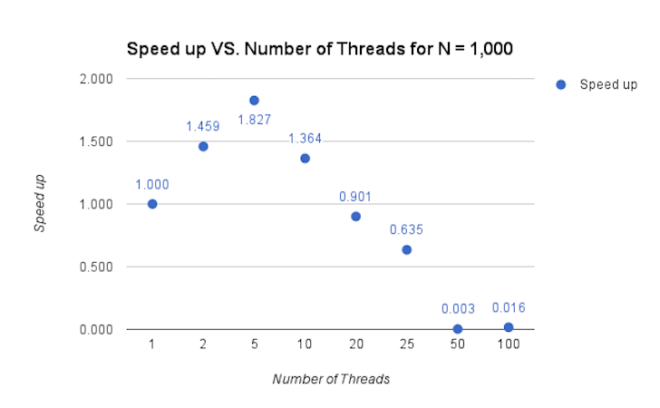
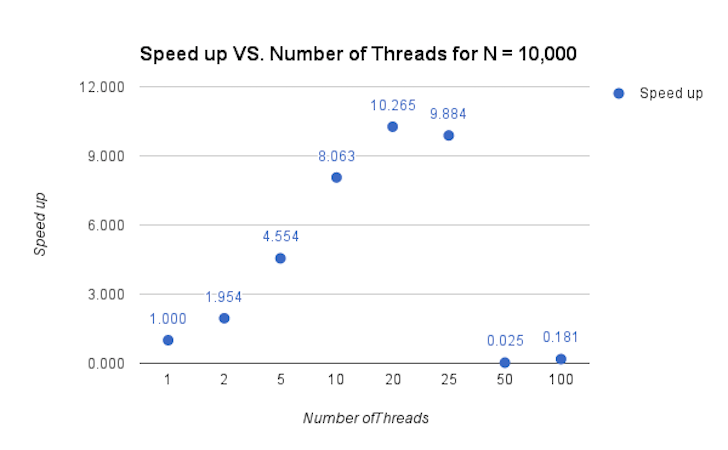

# Program Overview

I wrote a program to generate prime numbers from 2 to N and tested scalability and performance with different number of threads. There are many algorithms for generating prime numbers and for primality testing. Some are more efficient than others. For this exercise, I did not implement the most efficient serial algorithm (reasonings discussed below).

# Analysis



Note that I wrote a sufficiently fast enough code and parallelized it to get speed up. I did not use the most efficient serial algorithm, which is the sieve's prime number algorithm. I tried to parallelize the sieve's algorithm at first but did not get any speed up, even for 100,000 or a million numbers. After reviewing sieve's algorithm carefully, I noticed that it would be much more difficult to get a speed up from the algorithm when compared to mine. The following two blocks of code explains why.

(a) - my block of code (my algorithm)
```
#pragma omp for private(i)
  for(i = start+1; i<= N; i++){
    if(i % start == 0){
      array[i] = 1;
    }
  }
```

(b) - parallelize inner for loop of Sieve's algorithm
```
#pragma omp parallel for num_threads(thread_count) private(j)
for(j = start * start; j <= N; j+= start){
  //mark element as not prime
  array[j] = 1;
}
```
With my inner for loop (a), many more iterations are executed relative to sieve's inner for loop. For example, if we are looking for primes up to the 1000th number (N=1000) and the current multiple of 7 (start = 7) are going to be crossed out, my algorithm starts will start its search from 8,9, 10,...,up to 1000, thus N-i iterations. On the other hand, sieve will start its search at i = 7*7 (or i =49), with the following iteration being, 56, 63, 70,.. until the number exceeds 1000. The total number of iterations is (N/i - i/start), which is approximately N/i iterations. This is orders of magnitude less than my algorithm! Simply said, because my algorithm has so many more iterations than the sieve's algorithm, we can expect to see a better speed up when we parallelize our code because there is more work divided among the threads.

Now, onwards to the first graph, N=1000. We see a speed up for 2, 5 and 10 threads, with the highest speed up coming from 5 threads. To understand the speed up behavior in detail, I profiled the inner loop (block (a) above) because that is where most of the work and parallel execution is happening. I did this by putting a barrier then a start_time right before the omp parallel for directive, and end_time right after the for loop when all threads have completed.

Table that shows the average time spent completing the (a) for block with different number of threads for N=1,000.

#### Number of threads vs time and speed up
| Number of Threads | Time | Speed Up  |
| ------------- | ------------- | ------------- |
|  1  | 0.000013 | 1 |
|    5  | 0.000007 | 1.85|
| 25 | 	0.000014 | 0.928 |
| 50| 0.000030 | 	0.4333 | 	
| 100| 0.001184 | 0.01098 | 	

Note: speed up is calculated by taking time of thread 1 and dividing it by other thread number.

The table shows the result we expect. This result is important because it shows that this inner loop is what's giving us the speed up of our program. The speed up you get because of the inner for loop is almost exactly the same as the speed up you get from your program. Therefore, I can improve my program in the future even more if I can find ways to make this for loop more parallel friendly. The fact that we see such a huge slow down for inner loop completion time when we have 100 threads but a speed up with 5 threads shows that there is not enough work for all 50 threads to do efficiently, thus the cost of having this many threads outweighs the benefits gained from them. The optimal number of threads for N=1000 is around 5 threads for this algorithm.



Unlike N=1,000, we see a speed up for 2, 5, 10, a peak at 20, 25 and a sharp drop for 50 and 100 threads. The table below shows the average time spent completing the (a) for block for different number of threads for N=10,000.

#### Number of threads vs time and speed up
| Number of Threads | Time | Speed Up  |
| ------------- | ------------- | ------------- |
|  1  | 0.000127 | 1 |
|    5  | 0.000028 | 4.5 |
| 25 | 0.000015 | 8.46 |
| 50| 0.00026 | 	0.488 | 	
| 100| 0.00288 | 0.44097 | 	

A few interesting note. First, we see an increase in speed up from 2 to 25, peaking at around 20 threads, whereas we only see a speed up around 5 threads for N=1,000. This goes back to the point illustrated above - there is more work for the threads to do, so adding more threads will help. However, at a certain point, the cost of adding threads (creation, termination, etc.) outweighs their benefit because the data set is not large enough. We can see this for 50 and 100 threads. Second, similar to N=1,000, we see that the speed up of the inner loop is similar to the speed up we get for our program. Note that there is an anomaly - 50 threads is slower than 100 threads. This may be due to the way openmp and compiler is scheduling the threads.
