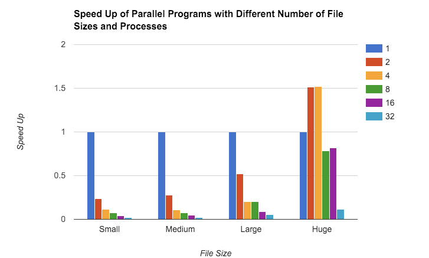

# Program Overview

Given a set of n equations with unknowns (X1 to Xn), I implemented a method that calculates the values of X1 to Xn within an error margin of e%. In addition, I also developed a detailed report (below), discussing the speedup relative to the number of processes, cores, and threads.

###Small text file
My program did not show speed up for small text file, in fact, the program slowed down as we added more processes. This is because the file is so small that there is not enough useful work for all the cores to do. Small text file contains only three unknowns, which requires very small amount of computation. Adding more cores will divide the already little work that one core has to do among many cores, and the cost of communication and coordination between the cores far outweighs the cost of single core computation. As we add more cores, at some point the additional cores will not have any work to do and they will only serve purely as overheads. In this case, this happens when we add more than three cores, since my program is designed to give each core one row.

###Medium text file
With a medium text file, my program did not show any speed up as you add more cores (actually a speed down). The graph shows the same exact trend as small text file for the same exact reason - there is not enough work for each core to do as we add more cores because the computation is already so small. However, in medium text file, the 6th core and above will be completely idle because there are only 5 rows. Again, the graph emphasizes that computation is small enough for one core and additional cores will mainly become overhead because the cost of communication outweighs the cost of computation.

###Large text file
With a large text file, my program shows the same trend as small and medium and the same logic applies as small text and medium text files. However, we begin to see to see that adding more cores is not having as bad of an effect as we did when we added them in small and medium. We can see that with two processes. In large text file, the result is two times slower than single process, while small and medium text file two processes are approximately four times slower than a single process. This shows that the core is having more useful work to do, but not enough yet since we are not seeing any speed up.

###Huge text file
With a huge text file, even though we did not get any speed up as we added more cores in small to large file sizes, the more important trend is the actual speed up increase for 2 to 64 processes as we increase the file size. We see this because all of the column graphs (except one process) are getting taller as we move from small to huge. For example, two processes for small, medium, large, huge were, were 4.3x slower, 3.7x slower, 1.9x slower and eventually 1.5x faster than one process. This trend emphasizes the same point I made above, as the file size increases, each core has more work to do, so the speed up increases. From small to large, there was not enough work for two processes so the cost of communication outweighed the cost of computation, but the difference of the two becomes less and less, hence the increase. Eventually, there is enough data for two processes to work efficiently, which is why we see the speed up for huge text file for two processes. The same reasoning applies for four processes. As for 8 to 32 processes, the same trend applies as well, but the difference is that even for huge data sets, there is not enough work for 8 processes still, and even less for 32, which is why we don't see the speed up. The take away is that parallel computing is suitable for projects that have lots of work to do.
